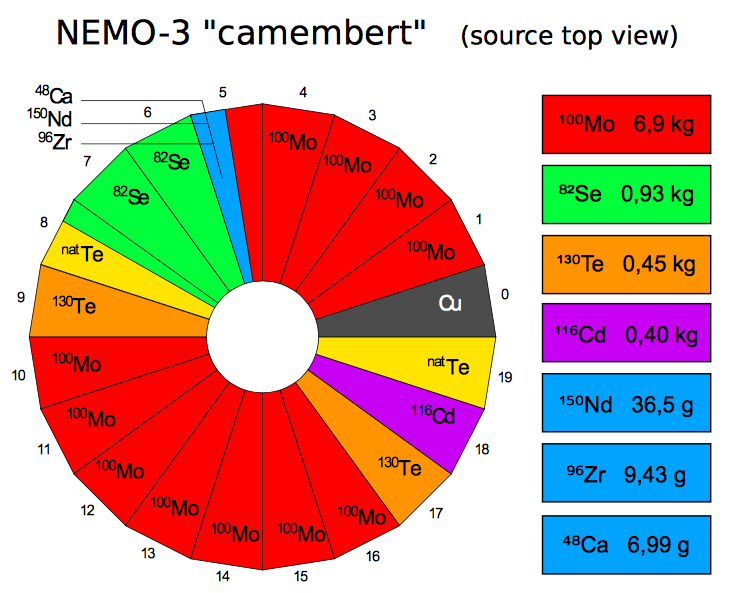
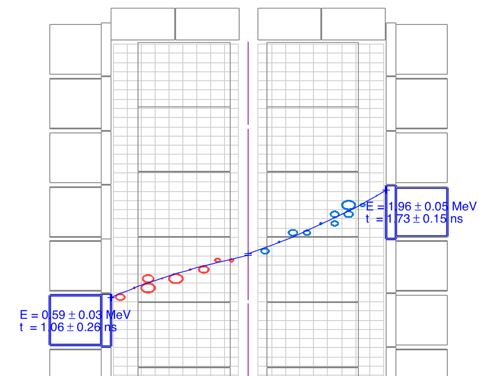

  

    

      
      

        <header class="post-header">
          <h1 class="post-title text-center">The SuperNEMO experiment</h1>
          </header>
              
Use the buttons on the right to find out more about the SuperNEMO detector, its physics goals, and the theory behind double-beta decay, the rare process we are investigating, which could provide clues to why our universe is the way it is. 

              
          

      

      <header class="post-header">
      <h1 class="post-title text-center"> The physics of SuperNEMO</h1>
    </header>

  

    <h4> About neutrinos</h4>
    
Neutrinos, the light, uncharged cousins of electrons, are the second-most abundant particles in the universe, with millions of them streaming through your body every minute. But even though they are everywhere, they are some of the least understood particles that we know about. Neutrinos have no electric charge, and until recently, we thought they had no mass, as predicted by the Standard Model of particle physics. Now we know that they do have mass - though they are very light -  but we don't know how. Thanks to experiments looking at a phenomenon called neutrino oscillations, we are starting to learn more about them, but there is still a lot we don't know. What are their absolute masses? How did they get them? And as they are electrically neutral - could they be their own antiparticles? By looking for an extremely rare process called neutrinoless double beta decay, SuperNEMO hopes to answer some of those questions.

  

<h4> Beta decay - two different kinds</h4>

  
There are many radioactive isotopes, with neutron-rich nuclei, that undergo beta decay. When this happens, a neutron in the nucleus decays to a proton, ejecting an electron ($\beta$ particle) and an electron-antineutrino. The resulting nucleus is more stable (has a lower energy). This 'lost' energy , $Q_\beta$, is shared between the electron and the neutrino.

  
For a handful of isotopes, the nucleus resulting from a single decaying neutron would not be more stable, meaning $\beta$ decay is forbidden. However, if <em>two</em> neutrons decay at <em>the same time</em>, we do get a lower-energy nucleus, with an energy difference we call $Q_{\beta\beta}$. This decay is very rare, with a half-life longer than the age of the universe. It has been observed for 12 nuclei, by experiments including our predecessor NEMO-3. As it produces two beta electrons and 2 (electron-anti)neutrinos, we call it $2\nu\beta\beta$, a 2-neutrino double beta decay.

  

    <h4>Neutrinoless double beta decay</h4>
    
This raises another possibility - what if neutrinos are their own antiparticles? (As with other electrically neutral particles, like the photon). In that case, in a $\beta\beta$ decay, the two antineutrinos could effectively annihilate, meaning our interaction produces only the two $\beta$ electrons, which carry the whole reaction energy $Q_{\beta\beta}$. This process is called neutrinoless double beta decay ($0\nu\beta\beta$), and so far, it has never been observed. SuperNEMO is trying to change that.

    
If we see a $0\nu\beta\beta$ decay, that has big implications for physics. In 1937, Ettore Majorana proposed a mechanism whereby neutrinos are their own antiparticles - known as Majorana neutrinos. Observing a $0\nu\beta\beta$ decay would prove that the theory was true, explaining how neutrinos get their mass, and giving us clues as to how we live in a universe made only of matter, and not antimatter.

  

  

    
  

    <header class="post-header">
      <h1 class="post-title text-center"> The SuperNEMO detector</h1>
    </header>

  

    

      
        <map name="detectormap">
          
          
          
          
          
          
          
          
          
          

      </map>
    

    

      
The SuperNEMO Demonstrator Module is located at the Laboratoire Souterrain de Modane, in the Fréjus tunnel in the French Alps. It acts as a proof of concept of our detector design, which can be expanded in future to a larger, modular detector.
      

      
 The Demonstrator Module has a tracker-calorimeter architecture, with a thin layer of $\beta\beta$-emitting isotope sandwiched between trackers and surrounded by calorimetry. This allows for a full three-dimensional reconstruction of charged particle tracks, as well as energy measurements. Click on the detector components in the diagram to learn more about each part of the detector.

    

  

<header class="post-header">
<h1 class="post-title text-center"> NEMO-3 detector</h1>
</header>

  

    

      
    

    

      
The NEMO-3 detector was the previous occupant of SuperNEMO's location in the LSM underground lab near Modane, France. Like SuperNEMO, NEMO-3 studied double-beta decay. It ran from January 14th, 2003 to January 11th, 2011. However, the NEMO collaboration had been working on this physics since 1989, starting with the NEMO-1 and NEMO-2 prototype detectors.

      
NEMO-3 had a similar tracker-calorimeter structure to SuperNEMO, but was cylindrical, with a hole running through the middle. The outside of the cylinder, as well as the central hole, was lined with calorimeter blocks similar to those used on SuperNEMO. Source foils were located in between, forming a cylinder of foils, with wire tracker cells filling the area between the source and the inner and outer calorimeter walls.
      

      

      The photo shows the detector almost closed, before the assembling of the 20th sector. Later, the gamma/neutron proof device was assembled around the detector (a shield made of iron plates, wood panels and tanks full of borated water), with an anti-radon tent enclosing the full setup.
      

    

  

   
  

    
    
      
    

  

   
  

    

      
This picture shows a neutrinoless double beta decay candidate event in the NEMO3 detector (top view). From the Geiger signal extracted from the drift cells along the charged particles trajectory (small coloured circles), one can here reconstruct the tracks of two charged particles: the curvatures in the magnetic field are compatible with electrons coming from the source foil (vertex) made of enriched molybdenum. The total energy deposit in the two hit scintillator blocks is 2875 keV which is expected for a neutrinoless double beta decaying $^{100}$Mo nucleus ( $Q_{\beta\beta}= 3\;\mathrm{MeV}$ ) corrected by energy loss in the source foil, the gas of the tracking chamber and convoluted by the calorimeter energy resolution.
      

    

    

      
    

  

   
  

    

      
        
        

    

      
 The NEMO-3 detector was divided into 20 sectors. Different sectors contained source foils of different $\beta\beta$ isotopes, allowing NEMO-3 to study decays in several different materials at the same time. This has enabled the NEMO-3 collaboration to produce an extensive set of analyses, which are still being worked on and published many years after the detector stopped taking data. As the diagram shows, the main isotope studied was molybdenum-100.
      

        

  

    <header class="post-header">
      <h1 class="post-title text-center"> Physics goals</h1>
    </header>

  

      

          <h4> An ultra-low background experiment</h4>
          
Neutrinoless double-beta decay (if it exists at all) is an extremely rare process. Experiments, including our predecessor NEMO-3, have shown that it must have a half-life of more than $10^{24}$ years- over a trillion times the age of the universe. This means that, even with our best detectors, we will never see more than a tiny handful of $0\nu\beta\beta$ decays. This presents a big challenge - how to eliminate background events: other kinds of decays or interactions that mimic our signal. SuperNEMO is leading the way in ultra-low background technology through a double-pronged approach: an extremely radio-pure detector, and a unique tracking technique that enables us to identify background decays and remove them from our data sample.

      

  

  

    

      
      <h4> Radiopurity and the radon challenge</h4>
      
For an ultra-low-background experiment, we need to take extra care to ensure that even low-level radioactive substances are kept away from our detector. All of SuperNEMO's components are constructed from materials that have been carefully selected for their radiopurity. Scientists working on the detector wear special suits to prevent any contamination from their bodies and clothes.

      
With these precautions in place, our biggest radiopurity challenge comes from radon, a naturally-occurring radioactive gas whose decay chain can mimic the $\beta\beta$ signature. Potential detector components are tested for radon activity. Our requirements are so strict, we have to collect any radon produced by the components over a long period of time, and then concentrate it, in order for even a state-of-the-art radon detector to be able to measure its activity. In addition to this, SuperNEMO is contained within an anti-radon tent, which is flushed with purified gas. Using these techniques, we aim to have a radon activity less than 0.15 mBq/m$^3$, or approximately 1 decay every 10 minutes - a world-leading purity, 30 times better than our predecessor, NEMO-3.

      

  

  

    

    <h4> Particle identification</h4>
       
Many double-beta decay experiments are only able to measure the energy deposited when a decay happens. SuperNEMO's unique tracker-calorimeter design allows us to follow the passage of particles through the detector. By looking at the length and orientation of tracks, and using a magnetic field to help us determine the particle's charge, we are able to identify different types of particle as they move through the detector, allowing us to reject events that don't match our two-electron $\beta\beta$ decay signature. By using the timing and energy measurements from our calorimeter walls, we are able to distinguish $\beta\beta$-like decays, where two particles leave the source foil at the same time, from events where a particle passes into the detector from outside, scatters from the foil, and then leaves the detector. The calorimeters also help us identify events with the characteristic energy of a $0\nu\beta\beta$ decay, allowing us to reject our biggest background, $2\nu\beta\beta$ events, which deposit less energy. Using this combination of techniques, we have a unique ability to isolate true $0\nu\beta\beta$ events.

    

  

  

    

      <h4> The power of SuperNEMO</h4>
      
With this world-class background rejection, the SuperNEMO demonstrator should be well-place to identify the first $0\nu\beta\beta$ mankind has ever seen - or alternatively, to set a limit on the $0\nu\beta\beta$ half-life of 6.5$\times$10$^{24}$ years. A proposed full SuperNEMO, consisting of 20 modules, could increase this half-life sensitivity to 10$^{26}$ years.

      
In addition to this, the SuperNEMO technology is ideal for investigating $2\nu\beta\beta$ decays - not just in selenium-82 but in other isotopes, thanks to the modular technology which allows for the source foils to be swapped out. The detector could also be used for other kinds of new physics searches, such as looking for evidence of Lorentz violation.

    

  

    

  <header class="post-header">
    <h1 class="post-title text-center"> Financial support</h1>
  </header>
  

    

      
The NEMO collaboration would like to acknowledge the support of the following funding agencies: 

    

  

        
        
        

          
        

          

            

          <a href="{{ agency.url }}" target="_blank"> </a>
          

            

        

        

          <a href="{{agency.url}}" target="_blank">
            {{ agency.Agency }}
            </a>
        

        

        
        

  

    
    

    

      

        

          

            

              The physics
            

          

        

      

      

        

          

            

              SuperNEMO detector
            

          

        

      

      

        

          

            

              NEMO-3 detector
            

          

        

      

      

        

          

            

              Physics goals
            

          

        

      

      

        

          

            

              Financial support
            

          

        

      

     

  

<!-- Calorimeter Modal -->

  

    <!-- Modal content-->
    

      

        <button type="button" class="close" data-dismiss="modal">&times;</button>
        <h4 class="modal-title">Calorimeter wall</h4>
      

      

        
          
The calorimeter walls at the outside of the detector measure the energy of particles that reach the edge of the detector. The two main calorimeter walls consist of 520 optical modules. These are blocks of polystyrene scintillator coupled to 8” photomultiplier tubes and wrapped in teflon and mylar, with individual iron shielding.

          
          
            
There are also optical modules positioned above, below and to the sides of the tracker, giving a total of 712 modules. This allows SuperNEMO to measure particles' energies, whatever direction they travel in.

            

      

        <button type="button" class="btn btn-default" data-dismiss="modal">Close</button>
      

    

  

<!-- Source foil Modal -->

  

    <!-- Modal content-->
    

      

        <button type="button" class="close" data-dismiss="modal">&times;</button>
        <h4 class="modal-title">Source foil</h4>
      

      

        
          
Our source frame sits in the middle of the detector, sandwiched between the two tracker sections. From the frame, we hang thin foils enriched in a $\beta\beta$ decaying isotope. By keeping these thin - just 0.3mm - we maximise the chance that decay electrons will escape the foil into our tracker. For our initial run, we are using selenium-82 as our source, ground to a powder, mixed with PVA, and formed into thin pads. However the design is such that it allows us to switch to other materials in future.
          

          

      

        <button type="button" class="btn btn-default" data-dismiss="modal">Close</button>
      

    

  

<!-- Tracker Modal -->

  

    <!-- Modal content-->
    

      

        <button type="button" class="close" data-dismiss="modal">&times;</button>
        <h4 class="modal-title">Wire tracker</h4>
      

      

        
          
To track charged particles' progress across the detector, we use a wire-chamber tracker. On each side of the detector, we have 108 columns of nine drift cells, each consisting of a central anode wire surrounded by field shaping wires, with a ring-shaped cathode at either end. The tracker is filled with helium, with a small amount of ethanol and argon. When a charged particle passes through the cell, the time for the resulting electron shower to drift to the anode tells us the particle's distance from the centre of the cell. Pulses on the two cathode end caps tell us how far along the wire the particle was. In this way, we can reconstruct particles' tracks through the tracker in three dimensions.

          
          
            
The image shows two reconstructed electron tracks from a simulated $0\nu\beta\beta$ decay, taken from the SuperNEMO event display software. Each circle corresponds to one tracker cell. The blue blocks at the end of the tracks are calorimeter blocks, which we use to measure the particles' energy. The tracks are curved because we also simulate a 25G magnetic field. By using applying a magnetic field, we are able to tell the charge of a particle from the way its track curves.

            
            

      

        <button type="button" class="btn btn-default" data-dismiss="modal">Close</button>
      

    

  

