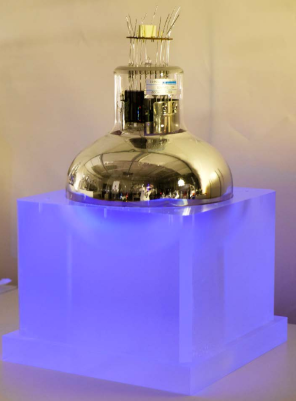

  

    

      

        <!-- Wrapper for slides -->
        


          

            

              

                <h4>{{slide.title}}</h4>
                {{slide.detail}}
              

            

          


        

        <!-- Controls -->
        <a class="left carousel-control" href="#carousel-example-generic" role="button" data-slide="prev">
          
          Previous
        </a>
        <a class="right carousel-control" href="#carousel-example-generic" role="button" data-slide="next">
          
          Next
        </a>
      

    

  

<header class="post-header">
<h1 class="post-title text-center">The SuperNEMO experiment</h1>
</header>

  

    

      

<a href="#thephysics">
        
        <h4>The physics</h4>
        
Learn about neutrinoless double beta decay

        </a>
      

      

        <a href="#detector">
        
        <h4>Our detector</h4>
        
See how the SuperNEMO demonstrator module works

        </a>
      

      

        
          <h4>Physics goals</h4>
          
What SuperNEMO can tell us

      

    

  

  

    <h2> The physics of SuperNEMO</h2>
  

  

    <h4> About neutrinos</h4>
    
Neutrinos, the light, uncharged cousins of electrons, are the second-most abundant particles in the universe, with millions of them streaming through your body every minute. But even though they are everywhere, they are some of the least understood particles that we know about. Neutrinos have no electric charge, and until recently, we thought they had no mass, as predicted by the Standard Model of particle physics. Now we know that they do have mass - though they are very light -  but we don't know how. Thanks to experiments looking at a phenomenon called neutrino oscillations, we are starting to learn more about them, but there is still a lot we don't know. What are their absolute masses? How did they get them? And as they are electrically neutral - could they be their own antiparticles? By looking for an extremely rare process called neutrinoless double beta decay, SuperNEMO hopes to answer some of those questions.

  

<h4> Beta decay - two different kinds</h4>

  
There are many radioactive isotopes, with neutron-rich nuclei, that undergo beta decay. When this happens, a neutron in the nucleus decays to a proton, ejecting an electron ($\beta$ particle) and an electron-antineutrino. The resulting nucleus is more stable (has a lower energy). This 'lost' energy , $Q_\beta$, is shared between the electron and the neutrino.

  
For a handful of isotopes, the nucleus resulting from a single decaying neutron would not be more stable, meaning $\beta$ decay is forbidden. However, if <em>two</em> neutrons decay at <em>the same time</em>, we do get a lower-energy nucleus, with an energy difference we call $Q_{\beta\beta}$. This decay is very rare, with a half-life longer than the age of the universe. It has been observed for 12 nuclei, by experiments including our predecessor NEMO-3. As it produces two beta electrons and 2 (electron-anti)neutrinos, we call it $2\nu\beta\beta$, a 2-neutrino double beta decay.

  

    <h4>Neutrinoless double beta decay</h4>
    
This raises another possibility - what if neutrinos are their own antiparticles? (As with other electrically neutral particles, like the photon). In that case, in a $\beta\beta$ decay, the two antineutrinos could effectively annihilate, meaning our interaction produces only the two $\beta$ electrons, which carry the whole reaction energy $Q_{\beta\beta}$. This process is called neutrinoless double beta decay ($0\nu\beta\beta$), and so far, it has never been observed. SuperNEMO is trying to change that.

    
If we see a $0\nu\beta\beta$ decay, that has big implications for physics. In 1937, Ettore Majorana proposed a mechanism whereby neutrinos are their own antiparticles - known as Majorana neutrinos. Observing a $0\nu\beta\beta$ decay would prove that the theory was true, explaining how neutrinos get their mass, and giving us clues as to how we live in a universe made only of matter, and not antimatter.

  

  

    
  

<a href="">Back to top</a>

  

      <h2> The SuperNEMO detector</h2>
  

  

    

      
        <map name="detectormap">
          
          
          
          
          
          
          
          
          
          

      </map>
    

    

      
The SuperNEMO Demonstrator Module is located at the Laboratoire Souterrain de Modane, in the Fréjus tunnel in the French Alps. It acts as a proof of concept of our detector design, which can be expanded in future to a larger, modular detector.
      

      
 The Demonstrator Module has a tracker-calorimeter architecture, with a thin layer of $\beta\beta$-emitting isotope sandwiched between trackers and surrounded by calorimetry. This allows for a full three-dimensional reconstruction of charged particle tracks, as well as energy measurements. Click on the detector components in the diagram to learn more about each part of the detector.

      

      <a href="">Back to top</a>
      

    

  

<!-- Calorimeter Modal -->

  

    <!-- Modal content-->
    

      

        <button type="button" class="close" data-dismiss="modal">&times;</button>
        <h4 class="modal-title">Calorimeter wall</h4>
      

      

        
        
The calorimeter walls at the outside of the detector measure the energy of particles that reach the edge of the detector. The two main calorimeter walls consist of 520 optical modules. These are blocks of polystyrene scintillator coupled to 8” photomultiplier tubes and wrapped in teflon and mylar, with individual iron shielding.

        
        
There are also optical modules positioned above, below and to the sides of the tracker, giving a total of 712 modules. This allows SuperNEMO to measure particles' energies, whatever direction they travel in.

      

      

        <button type="button" class="btn btn-default" data-dismiss="modal">Close</button>
      

    

  

<!-- Source foil Modal -->

  

    <!-- Modal content-->
    

      

        <button type="button" class="close" data-dismiss="modal">&times;</button>
        <h4 class="modal-title">Source foil</h4>
      

      

        
          
Our source frame sits in the middle of the detector, sandwiched between the two tracker sections. From the frame, we hang thin foils enriched in a $\beta\beta$ decaying isotope. By keeping these thin - just 0.3mm - we maximise the chance that decay electrons will escape the foil into our tracker. For our initial run, we are using selenium-82 as our source, ground to a powder, mixed with PVA, and formed into thin pads. However the design is such that it allows us to switch to other materials in future.
          

            

      

        <button type="button" class="btn btn-default" data-dismiss="modal">Close</button>
      

    

  

<!-- Tracker Modal -->

  

    <!-- Modal content-->
    

      

        <button type="button" class="close" data-dismiss="modal">&times;</button>
        <h4 class="modal-title">Wire tracker</h4>
      

      

        
          
To track charged particles' progress across the detector, we use a wire-chamber tracker. On each side of the detector, we have 108 columns of nine drift cells, each consisting of a central anode wire surrounded by field shaping wires, with a ring-shaped cathode at either end. The tracker is filled with helium, with a small amount of ethanol and argon. When a charged particle passes through the cell, the time for the resulting electron shower to drift to the anode tells us the particle's distance from the centre of the cell. Pulses on the two cathode end caps tell us how far along the wire the particle was. In this way, we can reconstruct particles' tracks through the tracker in three dimensions.

          
            
The image shows two reconstructed electron tracks from a simulated $0\nu\beta\beta$ decay, taken from the SuperNEMO event display software. Each circle corresponds to one tracker cell. The blue blocks at the end of the tracks are calorimeter blocks, which we use to measure the particles' energy. The tracks are curved because we also simulate a 25G magnetic field. By using applying a magnetic field, we are able to tell the charge of a particle from the way its track curves.

            

      

        <button type="button" class="btn btn-default" data-dismiss="modal">Close</button>
      

    

  

